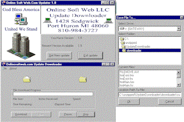

<div align="center">

## Program Updater


</div>

### Description

Update Your Program thru the net check the version

explan new changes, Downloan the update, then run the update. Please Vote If You Find This Usefull
 
### More Info
 
'You Also Need A (application.ver) File

'Example of application.ver

1.3

Downloads A New Version of Your Program

'If News.txt File Is not Complete The internet 'Lag Error Will Show.

'Example of news.txt below

This file contain list of news and repaired bugs in this application.

Version 1.3

----

Fix Bug

Version 1.1

----

Fix Bug

Version 1.0

----

Fix Bug


<span>             |<span>
---                |---
**Submitted On**   |2002-02-02 22:34:42
**By**             |[RLinder](https://github.com/Planet-Source-Code/PSCIndex/blob/master/ByAuthor/rlinder.md)
**Level**          |Advanced
**User Rating**    |4.8 (38 globes from 8 users)
**Compatibility**  |VB 5\.0, VB 6\.0
**Category**       |[Internet/ HTML](https://github.com/Planet-Source-Code/PSCIndex/blob/master/ByCategory/internet-html__1-34.md)
**World**          |[Visual Basic](https://github.com/Planet-Source-Code/PSCIndex/blob/master/ByWorld/visual-basic.md)
**Archive File**   |[Program\_Up52528222002\.zip](https://github.com/Planet-Source-Code/rlinder-program-updater__1-31440/archive/master.zip)

### API Declarations

```
Public Declare Function ShellExecute Lib "shell32.dll" Alias
"ShellExecuteA" (ByVal hwnd As Long, ByVal lpOperation As String,
ByVal lpFile As String, ByVal lpParameters As String, ByVal lpDirectory
As String, ByVal nShowCmd As Long) As Long
```


